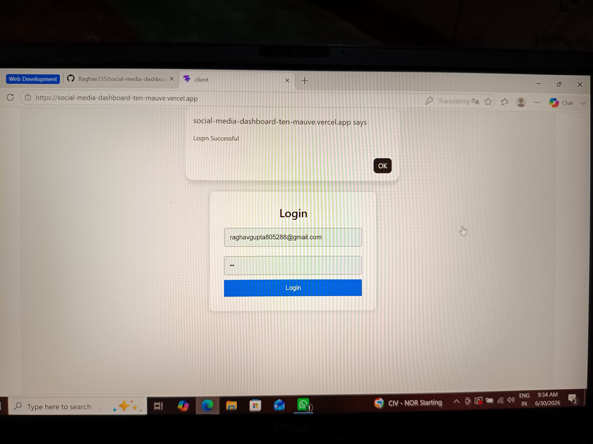
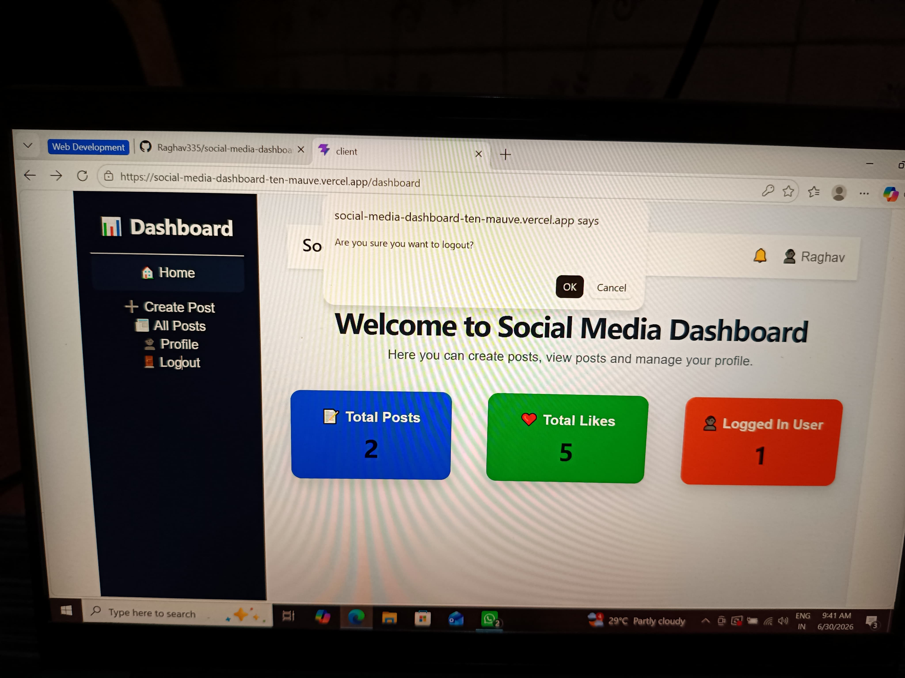
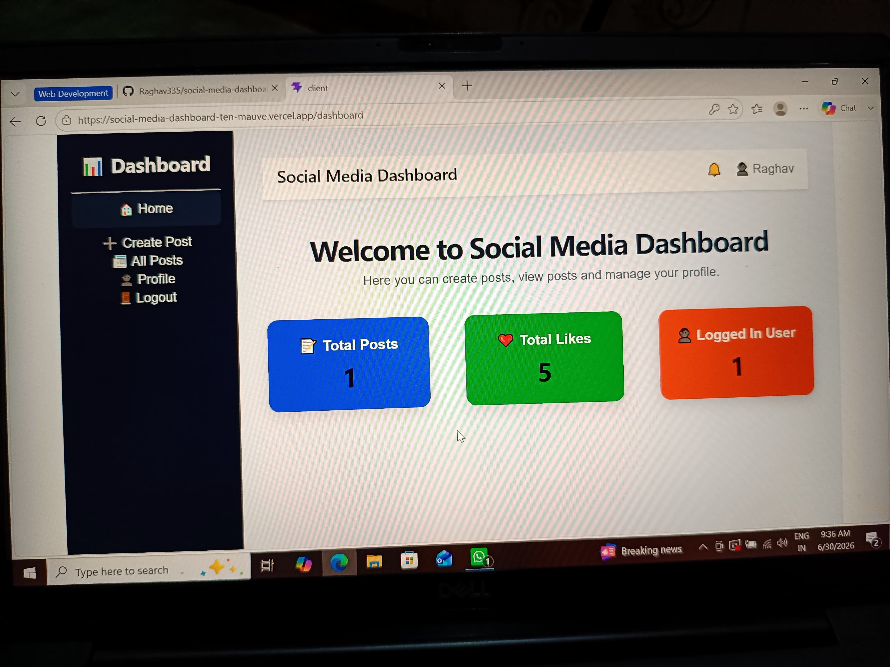
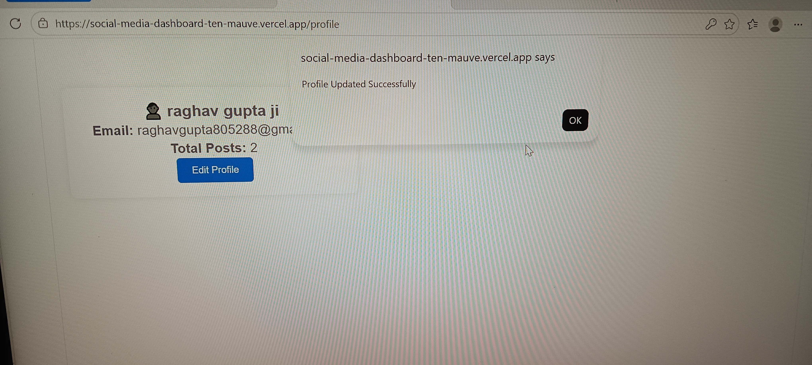

<div align="center">

# 📱 Social Media Dashboard

### Modern Full Stack MERN Application

A modern, responsive and user-friendly Social Media Dashboard built using the MERN Stack. The application enables users to create, manage and analyze social media posts through an intuitive interface with real-time analytics.


</div>

---

# 📖 Project Overview

Managing social media content efficiently requires a clean interface, secure authentication and meaningful analytics.

This project was developed to simulate a modern social media management platform where users can:

- Create and manage posts
- Track engagement through analytics
- Search and organize content
- Experience a responsive UI across devices
- Switch between Light and Dark Mode

The application demonstrates complete frontend-backend integration using the MERN Stack.

---

# ✨ Key Features

### 🔐 Authentication

- User Registration
- Secure Login
- Responsive Authentication Pages

### 📝 Post Management

- Create Posts
- Edit Existing Posts
- Delete Posts
- Like Posts
- Search Posts Instantly

### 📊 Dashboard & Analytics

- Dashboard Overview
- Statistics Cards
- Interactive Charts
- Total Posts
- Total Likes

### 👤 User Profile

- Profile Information
- Update Profile
- User Statistics

### 🎨 User Experience

- Responsive Design
- Mobile Friendly
- Dark Mode
- Modern UI
- Clean Navigation

---

# 🛠 Technology Stack

## Frontend

- React.js
- Vite
- React Router DOM
- Axios
- Recharts

## Backend

- Node.js
- Express.js

## Database

- MongoDB Atlas
- Mongoose

## Deployment

- Vercel
- Render

---

# 📸 Application Screenshots

## Login



---

## Register



---

## Dashboard



---

## Create Post


---

## All Posts


---

## Analytics


---

## Profile



---

## Mobile Responsive


---

# 📂 Project Structure

```text
client/
│
├── src/
│   ├── components/
│   ├── pages/
│   ├── context/
│   └── App.jsx
│
server/
│
├── controllers/
├── middleware/
├── models/
├── routes/
└── server.js

screenshots/

README.md
```

---

# 🚀 Installation

Clone Repository

```bash
git clone https://github.com/Raghav335/social-media-dashboard-.git
```

Install Frontend

```bash
cd client
npm install
npm run dev
```

Install Backend

```bash
cd ../server
npm install
npm start
```

---

# 🌐 Live Demo

 ## Frontend

https://social-media-dashboard-ukue-99e84upfi-raghav-gupta-jis-projects.vercel.app/


 ## Backend 

https://social-media-dashboard-backend-0pj7.onrender.com
---

# 💡 Future Improvements

- JWT Authentication
- Cloudinary Image Upload
- Comments
- Notifications
- AI Caption Generator
- Saved Posts
- Followers & Following
- Email Verification

---

# 🎯 Learning Outcomes

This project demonstrates practical understanding of:

- MERN Stack Development
- REST API Integration
- CRUD Operations
- MongoDB Database Design
- Responsive UI Development
- State Management
- Client-Server Communication
- Deployment using Vercel & Render

---

# 👨‍💻 Developer

## Raghav Gupta

Bachelor of Computer Applications (BCA)

MERN& Full Stack Developer


## GitHub

https://github.com/Raghav335

##linkdin 

https://www.linkedin.com/in/raghav-gupta-8a9152328?utm_source=share_via&utm_content=profile&utm_medium=member_android

---

## ⭐ Support

If you found this project useful,

please consider giving it a ⭐ Star.

It motivates me to build more high-quality open source projects.

---

<div align="center">

## Thank You ❤️

Made with dedication by **Raghav Gupta**

</div>